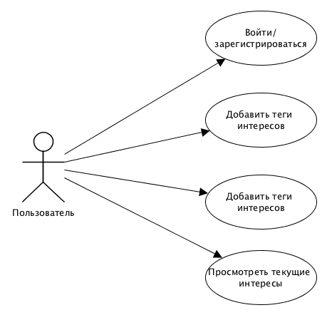

## Название проекта 
SmartFeed
## Предметная область
В повседневной жизни мы зачастую получаем огромное количество информации от различного рода источников. Сортировать весь этот поток порой либо лень, либо же попросту нет времени. Хотелось бы чтобы новости подстраивались под предпочтения, причём чем разнообразнее, тем лучше.
## Use-case диаграмма

## ER-диаграмма (*подфиксить)

## Прототип
TODO:Обсудить необходимость вкладки "Ваши интересы". "Добавить теги" решил пока не оформлять, но в целом будет просто строка для ввода тегов. 

## Технические решения
Backend:
* Postgresql
* Python + Flask/Django

Frontend: 
* React/Angular/Vue.js

Репозиторий:
* Gitlab

Багтрекер:
* Jira/Gitlab Issues

Ревью кода:
* Upsource/Gitlab

CI:
* Jenkins/Gitlab CI
## Архитектура приложения
TODO: Обсудить технологический стек, после этого нарисовать
